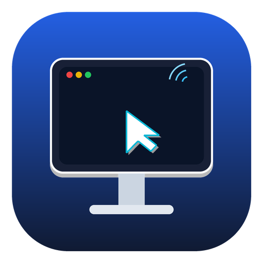

# VNC Android Free

<p align="center">
  
</p>

<p align="center">
  <b>VNC Android Free</b> is a modern, high-performance, open-source VNC client for Android featuring RealVNC-inspired desktop ergonomics, Jetpack Compose virtual keys, calibrated BMC paste timing, and full remote desktop control.
</p>

<p align="center">
  <a href="https://github.com/Vicky8106/avnc/releases/latest"></a>
  <a href="https://github.com/Vicky8106/avnc/actions"></a>
  <a href="COPYING.txt"></a>
</p>

---

### 📥 Download APK

* 🚀 **[Download Latest Release: VNC-android-free.apk (v1.7.0)](https://github.com/Vicky8106/avnc/releases/download/v1.7.0/VNC-android-free.apk)**
* Local repository binary: [`release/VNC-android-free.apk`](release/VNC-android-free.apk)

> [!NOTE]
> If updating from an earlier build with package name `com.gaurav.avnc`, please uninstall that version from your Android device first. Starting with `v1.7.0` (package `com.vncandroid.free`), a persistent keystore is configured so all future updates install in-place automatically.

---

### ✨ Features & Ergonomic Highlights

#### ⌨️ Jetpack Compose Virtual Keys & RealVNC Layout
- **Direct Function Keys (`F1` – `F12`)**: Replaced modal text consoles with a dedicated **`[Fn]`** toggle button. Tapping `[Fn]` slides out an organized Function Keys strip grouped into standard PC clusters (`F1-F4`, `F5-F8`, `F9-F12`) with calibrated 18ms HID timing.
- **Dedicated Windows (`Win`) Key**: Single tap triggers the remote Windows Start Menu or Linux App Launcher; hold-to-lock modifier enables `Win+R`, `Win+E`, `Win+D`, and `Win+X`.
- **Dedicated Forward Delete (`Del`) Key**: High-visibility Delete key for fast text and file management in terminals and GUI desktops.
- **RealVNC Inverted-T Navigation Pad**: Properly spaced Inverted-T arrow cluster (`Up` centered directly above `Down`, flanked by `Left` and `Right`) with generous touch targets (48–54dp wide) to prevent accidental misclicks. Flanked by `Home`/`End` and `PgUp`/`PgDn`.
- **Enlarged Scroll Controls**:
  - High-contrast `Scroll Up (▲)` and `Scroll Down (▼)` pads in the virtual keys toolbar with accelerated continuous scrolling.
  - Enlarged tactile scroll buttons in the floating virtual mouse bar.
  - **Floating Vertical Scroll Pillar**: Positioned along the right screen edge for comfortable one-thumb scrolling without blocking content.
- **Dedicated Mouse Mode Button**: One-tap toggle directly on the virtual keys bar to switch between keyboard input and mouse pointer control.
- **20% Transparent UI**: Modern Material 3 floating toolbar (`alpha = 0.80f`) keeps the remote desktop visible underneath.

#### 🔌 Reliable BMC, KVM & IPMI Console Support
- **Hardware-Calibrated Paste Timing**: Calibrated 18ms keypress duration and 22ms inter-key pacing to match physical server Baseboard Management Controller (BMC) USB HID polling cadences (~10–16ms). Eliminates buffer overflows and skipped keystrokes on Dell iDRAC, HP iLO, Supermicro IPMI, and Lenovo XCC consoles.
- **Hardware Shift & Caps Protection**: Raw RFB keysym transmission avoids synthetic `Shift_L` injection, preventing remote hardware modifiers from getting stuck down.
- **Guaranteed Modifier Release**: Every paste sequence enforces guaranteed cleanup across Shift, Ctrl, Alt, Meta, and Caps Lock.
- **Full Soft & Hardware Keyboard Input**: Enter, Space, Tab, Backspace, and all special symbols (`!@#$%^&*()_+-=[]{}|;':",.<>?/~`) are dispatched cleanly with zero lost spaces.

#### 🌐 Enterprise & Remote Desktop Protocols
- **Encryption & Security**: Anonymous TLS and VeNCrypt support for secure encrypted streams.
- **Built-in SSH Tunnel**: Connect securely to remote hosts over SSH (`VNC over SSH`).
- **Encodings**: High-performance Tight, ZRLE, Hextile, Raw, and CopyRect encodings with configurable JPEG compression.
- **UltraVNC Repeater**: Connect to servers through UltraVNC repeater proxies (Mode I & Mode II).
- **Wake-on-LAN**: Wake sleeping servers directly over local network or Internet.
- **Automatic Server Discovery**: Zeroconf / mDNS server discovery.
- **Convenience**: Picture-in-Picture (PiP) multitasking, View-only mode, and Remote/Local cursor customization.

---

### 🛠️ Building from Source

#### Prerequisites
- **Git** with submodule support
- **Android Studio** Ladybug or newer
- **JDK 17** (Temurin recommended)
- **Android SDK & NDK** (CMake 3.22.1+)
- C++ build tools (for `vcpkg` native dependencies)

#### Build Instructions
```bash
# Clone repository with submodules
git clone https://github.com/Vicky8106/avnc.git
cd avnc
git submodule update --init --depth 1

# Build debug APK
./gradlew assembleDebug

# Output APK is located at:
# app/build/outputs/apk/debug/app-debug.apk
```

---

### 📄 License

VNC Android Free is licensed under the [GNU General Public License v3.0](COPYING.txt) (GPL-3.0-or-later).